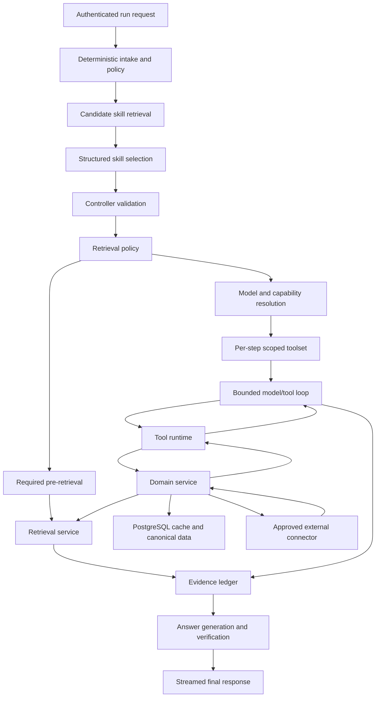

# Phase 3.5: Model-Agnostic Agent Harness

Status: implementation specification

Target position: immediately after Phase 3C and before corpus ingestion

This phase turns the current single-answer agent into a bounded, observable harness that can
select trusted skills, expose only their permitted tools, execute tool calls through application
services, and produce evidence-backed answers across multiple model providers. It deliberately
does not implement the complete Wiki corpus, full build mathematics, or long research mode.
Those capabilities plug into this foundation in later phases.

## 1. Current State And Gap

The current runtime in `apps/api/src/veris_api/agent.py` is one Pydantic AI agent using an
`OpenRouterModel`. It receives the conversation transcript and a static operational prompt,
then returns a typed `TurnResult`. The current prompt correctly states that no retrieval,
Warframe.market, or other tools are available.

Therefore, at the start of Phase 3.5:

- no function tools or toolsets are registered with the model;
- no skill registry or workflow selection exists;
- no per-step tool exposure policy exists;
- no tool-call/result ledger exists;
- no cache-freshness policy can choose between stored and live market data;
- no provider capability negotiation exists beyond the configured OpenRouter route;
- Pydantic AI's output schema is used for the final response, not for agentic tool execution.

The existing DBOS workflow, cancellation path, provider-attempt accounting, quotas, event
stream, and authenticated ownership model remain valuable and must be extended rather than
replaced.

## 2. Decisions

### 2.1 Keep Pydantic AI As The Provider Layer

Thesos is pinned to Pydantic AI 2.31.0. It already provides typed function tools, toolsets,
dynamic tool preparation, provider adapters, streaming events, structured outputs, and DBOS
integration. Adding a second general agent framework would create competing run loops and
duplicate cancellation, persistence, usage, and provider logic.

Thesos will place its own deterministic controller around Pydantic AI:

```text
Thesos controller and policy
  -> skill registry and selector
  -> scoped Pydantic AI toolset
  -> provider-neutral model gateway
  -> provider adapter
```

Pydantic AI remains replaceable behind Thesos-owned interfaces. Workflow code must not import
provider-specific request or response types.

### 2.2 Skills, Tools, And Connectors Are Different Things

| Concept | Responsibility | Example |
|---|---|---|
| Skill | Versioned workflow knowledge, boundaries, tool allowance, and output contract | `market_item_price` |
| Tool | One typed operation the model may request | `get_market_price` |
| Service | Deterministic application logic behind one or more tools | `MarketService` |
| Connector | Restricted client for an external data source | `WarframeMarketClient` |

A skill is not an arbitrary script and a tool is not a raw API endpoint. The model never gets
generic HTTP, SQL, filesystem, shell, or Python execution.

### 2.3 Progressive Disclosure

At run intake, the model may see compact metadata for a small candidate set of skills. Full
skill instructions and tool schemas are introduced only after a skill is selected. This follows
the useful Codex pattern of advertising concise skill metadata before loading a selected
workflow's complete instructions.

Thesos will not copy Codex's filesystem-oriented skill execution model. Production skills are
trusted, versioned application resources, loaded from the deployed image and validated at
startup.

### 2.4 The Host Is Sovereign

The model may propose a skill, tool, arguments, and whether current information is semantically
important. Application code decides:

- whether the user and run may use the skill;
- whether the selected model can reliably satisfy its contract;
- which tools are visible on this step;
- whether cached evidence satisfies the declared freshness policy;
- whether an upstream request is permitted by rate, concurrency, and circuit-breaker state;
- whether arguments are valid and canonical;
- whether results are persisted, redacted, truncated, or rejected;
- whether the run continues, retries, replans, clarifies, or stops.

The model never writes directly to PostgreSQL and never controls cache TTLs, retries, budgets,
or upstream pacing.

### 2.5 What Thesos Takes From Codex

The open-source Codex core provides several patterns worth copying at the architectural level:

- the turn loop samples the model, executes correlated tool calls, appends their results, and
  samples again until a non-tool terminal response is produced;
- each step receives an exact model-visible tool plan rather than inheriting every registered
  capability;
- tool registration is separate from tool exposure and rejects collisions or incompatible call
  payloads;
- routing validates the canonical tool name, call ID, payload kind, and arguments before dispatch;
- pre/post hooks, telemetry, lifecycle events, cancellation, and result persistence surround the
  handler outside model control;
- parallel execution is an explicit property of each tool, while unsafe calls are serialized;
- skills use progressive disclosure instead of placing every workflow's full instructions in the
  initial context.

Thesos does not copy Codex's general shell, filesystem, patching, code execution, approval UI,
or arbitrary local skill-discovery surface. Codex operates inside a user-controlled development
environment; Thesos is a multi-user public service. Its trusted domain registry, read-only tools,
tenant checks, fixed budgets, and external-source policies must therefore be substantially
narrower.

## 3. Target Architecture



The model/tool loop is nested inside one controller step. It is not the top-level controller.
The outer controller regains control after each step and applies budgets, evidence checks, and
terminal-state rules.

## 4. Package Layout

Add the following boundaries without moving unrelated existing modules:

```text
apps/api/src/veris_api/
|-- agent.py                         # compatibility entry point during migration
|-- agent_harness/
|   |-- controller.py               # typed state transitions
|   |-- models.py                   # run, step, decision, and evidence contracts
|   |-- events.py                   # sanitized public progress events
|   |-- budgets.py                  # shared run and step budgets
|   |-- stopping.py                 # duplicate/no-progress/terminal rules
|   `-- prompt_assembly.py          # trusted instructions plus untrusted context
|-- model_gateway/
|   |-- gateway.py                  # role and capability resolution
|   |-- capabilities.py             # provider/model capability matrix
|   |-- profiles.py                 # logical model profiles
|   |-- credentials.py              # server and later BYOK references
|   `-- adapters/                    # Pydantic AI model construction
|-- skills/
|   |-- registry.py                 # load, validate, and select manifests
|   |-- selector.py                 # deterministic candidates plus typed model decision
|   |-- manifests/
|   |   |-- market_item_price.yaml
|   |   |-- market_category_rank.yaml
|   |   `-- riven_endo_value.yaml
|   `-- instructions/               # full selected-skill instructions
|-- tools/
|   |-- registry.py                 # canonical tool definitions and handlers
|   |-- runtime.py                  # validation, hooks, dispatch, and result envelope
|   |-- policy.py                   # visibility, authorization, and side effects
|   `-- toolsets.py                 # Pydantic AI filtered/prepared toolsets
|-- retrieval/
|   |-- protocols.py                # provider-neutral retrieval contracts
|   |-- policy.py                   # required, optional, and prohibited retrieval
|   |-- context_packer.py           # shared evidence packing and token budgets
|   `-- tools.py                    # scoped follow-up retrieval tools
|-- domains/
|   |-- market/
|   |   |-- service.py
|   |   |-- client.py
|   |   |-- cache_policy.py
|   |   |-- schemas.py
|   |   `-- tools.py
|   `-- mechanics/
|       |-- registry.py
|       |-- engine.py
|       |-- schemas.py
|       `-- tools.py
`-- db/
    |-- agent_harness.py
    |-- market.py
    `-- mechanics.py
```

The existing Python package remains named `veris_api` during Phase 3.5. Renaming it is unrelated
and would add deployment risk without improving the harness.

## 5. Canonical Contracts

All contracts are Pydantic models or enums owned by Thesos. The exact field names may evolve
during implementation, but their responsibilities are fixed.

### 5.1 Model Capabilities

```python
class ModelCapabilities(BaseModel):
    native_tools: bool
    strict_tool_schema: bool
    parallel_tool_calls: bool
    streaming_tool_arguments: bool
    structured_output: bool
    reasoning_controls: bool
    vision: bool
    cancellation: bool
    maximum_tools: int | None
    context_tokens: int
    output_tokens: int
    reliability_class: Literal["verified", "conditional", "unsupported"]
```

Capabilities are measured and configured, not inferred from a provider name. A model profile is
enabled for a tool-bearing role only after conformance tests pass.

### 5.2 Skill Manifest

```python
class SkillManifest(BaseModel):
    skill_id: str
    version: str
    name: str
    summary: str
    trigger_examples: list[str]
    exclusion_examples: list[str]
    required_entities: list[str]
    allowed_tool_ids: list[str]
    retrieval_policy: Literal["none", "required_prefetch", "on_demand", "hybrid"]
    allowed_collections: list[str]
    maximum_retrieval_passes: int
    maximum_retrieval_candidates: int
    default_freshness: str
    maximum_model_requests: int
    maximum_tool_calls: int
    maximum_wall_seconds: int
    output_schema: str
    instructions_path: str
    evaluation_suite: str
```

Manifests are immutable within a release. Startup fails if a manifest references an unknown
tool, invalid schema, missing instruction file, or impossible budget.

### 5.3 Tool Definition

```python
class ToolSpec(BaseModel):
    tool_id: str
    version: str
    description: str
    input_model: str
    output_model: str
    side_effect: Literal["read_only", "internal_write", "external_write"]
    timeout_seconds: float
    retry_policy: str
    cache_policy: str | None
    parallel_safe: bool
    idempotent: bool
    result_size_limit: int
```

Only read-only domain operations are model-callable in Phase 3.5. Internal cache writes are an
implementation detail of the service and are not a model-visible side effect.

### 5.4 Tool Result Envelope

```python
class ToolResultEnvelope[T](BaseModel):
    status: Literal["ok", "not_found", "ambiguous", "stale", "unavailable", "rejected"]
    data: T | None
    evidence: list[EvidenceRecord]
    observed_at: datetime | None
    expires_at: datetime | None
    cache_status: Literal["hit", "miss", "refreshed", "stale_hit", "not_cacheable"]
    warnings: list[str]
    retry_after_seconds: int | None
```

The model receives normalized results, never raw upstream headers or unrestricted payloads.

### 5.5 Evidence Record

```python
class EvidenceRecord(BaseModel):
    evidence_id: UUID
    source_type: str
    source_url: HttpUrl | None
    source_revision: str | None
    observed_at: datetime
    freshness: Literal["live", "fresh", "stale", "historical"]
    filters: dict[str, JsonValue]
    content_hash: str
    payload_reference: str
```

Large payloads remain in canonical/cache tables. Agent state stores references and compact
summaries.

Retrieval candidates and ordinary tool outputs both become evidence records. Their source types,
scoring metadata, revisions, observation times, and payload references differ, but citation and
verification code must not need to know which acquisition path produced them.

### 5.6 Model Events

Provider wire formats are converted into a small internal event union:

```text
ModelStarted
ModelTextDelta
ModelToolCallStarted
ModelToolCallArgumentsDelta
ModelToolCallCompleted
ModelUsageReported
ModelCompleted
ModelFailed
```

Workflow code does not inspect OpenAI, Anthropic, Gemini, Mistral, or OpenRouter message shapes.

## 6. Skill Selection

Skill selection uses three layers.

### 6.1 Deterministic Candidate Retrieval

Normalize the request and retrieve at most five candidate skills from:

- explicit UI mode or requested capability;
- recognized Warframe entities and aliases;
- deterministic intent keywords and patterns;
- conversation state and the previously active skill;
- required freshness, image, calculation, or comparison characteristics.

Obvious cases may be selected without another model call. For example, a request for the current
price of a resolved item maps directly to `market_item_price`.

### 6.2 Structured Model Decision

When candidates are ambiguous, a low-cost structured-output model receives only the compact
candidate metadata and returns:

```python
class SkillSelection(BaseModel):
    selected_skill_id: str | None
    confidence: float
    interpreted_goal: str
    required_freshness: Literal["historical", "cached_ok", "current"]
    missing_information: list[str]
```

The model cannot name a skill outside the supplied candidate IDs. Low confidence or missing
required entities produces clarification, not a generic tool-bearing answer run.

### 6.3 Controller Validation

Before loading full instructions, validate:

- skill is enabled for the release and user cohort;
- user policy permits it;
- required entities are present or resolvable;
- run budget can afford its minimum path;
- at least one eligible model satisfies its capabilities;
- every referenced tool is registered and healthy enough to expose.

Only then are the full skill instructions and scoped toolset added to the step.

## 7. Retrieval And Tool Coexistence

RAG is an evidence-acquisition capability inside the harness, not a separate answer pipeline. A
skill declares one of four retrieval policies:

| Policy | Meaning | Example |
|---|---|---|
| `none` | Corpus retrieval is irrelevant or prohibited | Pure arithmetic from supplied inputs |
| `required_prefetch` | Retrieve before the answer/model step | A direct Wiki lore question |
| `on_demand` | Model may request bounded retrieval if needed | Exploratory build discussion |
| `hybrid` | Prefetch core evidence and permit focused follow-up retrieval | Mechanics plus live market data |

### 7.1 Required Pre-Retrieval

For known archive-answer intents, deterministic code resolves entities, constructs a typed query,
runs candidate retrieval, applies deterministic fusion/scoring, and packs the best evidence before
the answer model runs. The model cannot choose to skip the primary corpus merely because its
internal memory appears sufficient.

This path is cheaper and more reliable for straightforward questions because it avoids an extra
model sampling round solely to request obvious retrieval.

### 7.2 On-Demand Retrieval Tool

Complex skills may receive a high-level `search_archives` tool. It accepts a bounded semantic
query, canonical entity IDs, allowed collection IDs, source filters, and requested facets. It does
not expose raw SQL, BM25 syntax, vector queries, filesystem paths, or arbitrary corpus selection.

The retrieval service performs query normalization, alias expansion, candidate generation,
fusion, deterministic second-stage scoring, and result-size enforcement. The model receives a
compact evidence bundle with stable evidence IDs rather than an unbounded concatenation of raw
chunks.

### 7.3 Mixed RAG And Domain-Tool Runs

A single run can combine corpus and live evidence:

```text
question: "How does Galvanized Aptitude work, and what does it cost right now?"

required corpus retrieval
  -> mechanic and limitations from a versioned Wiki revision

market tool
  -> current normalized listings and observation time

shared evidence ledger
  -> claim support, freshness, conflict checks, and final citations
```

The final answer does not receive separate "RAG context" and "tool context" blobs with competing
formats. `ContextPacker` selects from one ledger and assigns token space by evidence facet,
authority, freshness, diversity, and required claim coverage.

### 7.4 Retrieval Contracts Prepared In Phase 3.5

Define these contracts before the real corpus exists:

```python
class RetrievalRequest(BaseModel):
    query: str
    entity_ids: list[str]
    collection_ids: list[str]
    facets: list[str]
    source_filters: dict[str, JsonValue]
    corpus_revision: str | None
    candidate_limit: int

class RetrievalCandidate(BaseModel):
    evidence: EvidenceRecord
    document_id: str
    section_id: str
    title: str
    heading_path: list[str]
    excerpt: str
    lexical_score: float | None
    semantic_score: float | None
    fused_score: float
    ranking_reasons: list[str]

class RetrievalBundle(BaseModel):
    request: RetrievalRequest
    corpus_revision: str
    candidates: list[RetrievalCandidate]
    coverage: list[str]
    unresolved_facets: list[str]
```

Phase 3.5 implements the interfaces, policy, context packer, evidence conversion, and a deterministic
fixture retriever. Phase 4 supplies the real BM25/entity implementation. Phase 5 enables the
`archive_answer` skill against the validated corpus.

### 7.5 Duplicate And Loop Control

Retrieval hashes include normalized query, canonical entities, collections, filters, and corpus
revision. A repeated request with the same hash reuses the persisted bundle. A second retrieval
pass is allowed only when the evidence assessor identifies an unresolved facet and the revised
query or filters materially differ.

Initial limits are one prefetch plus one focused follow-up pass. Retrieval cannot recursively call
the agent, add a collection, or increase its candidate/context budget.

### 7.6 Provenance, Freshness, And Conflict Handling

- Every chunk retains source, immutable revision, section identity, URL, content hash, and licence
  attribution metadata.
- Corpus revision freshness and live-data observation freshness are distinct fields.
- Retrieved text and external tool payloads are both untrusted evidence, never instructions.
- Duplicate evidence is collapsed by source/revision/section/content hash before context packing.
- Conflicting evidence remains separately represented and is surfaced to the assessor rather than
  silently merged.
- Citation IDs point to evidence records, not token offsets in one assembled prompt.
- Cache keys include corpus revision, skill version, retrieval policy, and relevant tool snapshot
  versions so updates invalidate only affected answers.

### 7.7 Context Budgeting

Reserve context independently for:

```text
global and selected-skill instructions
bounded conversation state
required corpus evidence
live/domain tool evidence
model working/output allowance
```

The packer never lets a large market payload evict the only evidence supporting a mechanics claim,
or lets many similar chunks crowd out source diversity. Tool handlers and retrieval services reduce
large intermediate results before they enter model context.

## 8. Prompt And Tool Exposure Policy

The selected step prompt has stable sections:

1. global Thesos behavior and safety policy;
2. controller-owned step objective and stopping rule;
3. selected skill instructions and version;
4. exact tool allowance and usage boundaries;
5. typed run context, constraints, platform, and freshness requirement;
6. untrusted conversation and evidence blocks, clearly delimited;
7. required structured step output.

Tool descriptions explain when to use the tool, when not to use it, required arguments, and what
its freshness fields mean. Generic advice such as "use tools when helpful" is insufficient.

Pydantic AI `FilteredToolset` or an equivalent `prepare_tools` hook removes tools not authorized
for the current step. `PreparedToolset` may add step-specific descriptions or disable unsupported
parameters. Tool names are stable across providers.

The model never receives all Thesos tools at once.

## 9. Bounded Model And Tool Loop

One step follows this state machine:

```text
PREPARE
-> SAMPLE_MODEL
-> TOOL_CALL_PROPOSED or STEP_OUTCOME
-> VALIDATE_TOOL_CALL
-> EXECUTE_TOOL
-> PERSIST_RESULT
-> SAMPLE_MODEL
-> STEP_OUTCOME
```

Required invariants:

- a tool result is persisted with its call ID before the next model sample;
- a tool call can only target the current scoped registry;
- Pydantic validates arguments before handler execution;
- canonical argument hashes suppress duplicate calls;
- model-request, token, tool-call, upstream-request, time, and cost budgets are shared by all
  nested operations;
- the model cannot increase its own budget or select another skill;
- one targeted argument correction is allowed for a validation failure;
- repeated invalid, duplicate, or no-progress calls end the step safely;
- the loop stops only on a valid `StepOutcome` or a controller terminal condition;
- cancellations propagate to the active provider stream and cancellable tool task.

Initial per-step commissioning limits:

| Limit | Simple lookup | Category comparison | Calculation |
|---|---:|---:|---:|
| Model requests | 2 | 3 | 3 |
| Tool calls | 2 | 4 | 4 |
| Live upstream calls | 1 | 0 in request path | 0 |
| Hard wall time | 30 s | 45 s | 30 s |
| Argument repair attempts | 1 | 1 | 1 |

These are ceilings, not targets. A deterministic direct tool route may use only one answer-model
request after the tool result.

## 10. Tool Runtime

`ToolRuntime` wraps every handler with the same lifecycle:

1. resolve canonical tool ID and version;
2. verify step exposure, user policy, and side-effect class;
3. validate and normalize arguments;
4. reserve tool and external-request budget;
5. detect duplicate or conflicting calls;
6. emit a sanitized progress event;
7. execute under timeout, cancellation, concurrency, and retry policy;
8. normalize the result envelope;
9. persist tool call, cache/upstream accounting, and evidence references;
10. emit completion or failure event;
11. return the call-correlated result to the model.

Retries occur in one layer only. Domain services own endpoint-aware retries for upstream calls;
DBOS owns durable workflow recovery; the model does not retry transport errors by improvisation.

Parallel execution is opt-in per tool. Tools that only read independent local records may run in
parallel. Calls sharing a refresh key, mutation boundary, or strict external rate limit are
serialized or coalesced.

## 11. Cache And Freshness

Freshness is a code-level policy, not a model preference disguised as a TTL.

### 11.1 Inputs

The controller combines:

- user language such as "right now", "today", or "roughly";
- skill default freshness;
- endpoint-specific TTL and known reset schedule;
- `observed_at` and `expires_at` on stored data;
- connector health, backoff, and rate budget;
- whether stale data is safe and useful for this answer type.

### 11.2 Outcomes

| Condition | Behavior |
|---|---|
| Fresh cache satisfies request | Return it without external traffic |
| Stale cache, current data required | Coalesced refresh, then return and persist |
| Stale cache, approximate data acceptable | Return marked stale data and queue refresh |
| No cache, refresh allowed | Fetch once, normalize, upsert, return |
| No cache, upstream unavailable | Return typed unavailable result |

The result always discloses its observation time and freshness. The answer layer must preserve
material freshness warnings.

### 11.3 Singleflight And Rate Policy

Concurrent requests for the same canonical refresh key share one in-flight operation. Use a
PostgreSQL advisory lock or a small in-process singleflight map plus a database refresh lease so
multiple worker processes cannot stampede the source.

Every connector has:

- global and endpoint-specific token buckets below the published maximum;
- maximum concurrent connections;
- `Retry-After`, 429, and service-specific backoff handling;
- a circuit breaker with stale-read behavior;
- descriptive application User-Agent;
- upstream-call metrics independent of model tool-call metrics.

## 12. Warframe.market Vertical Slice

Warframe.market is the first complete skill/tool/service/connector implementation.

### 12.1 Connector Rules

- Use the documented v2 API and stable public endpoints.
- Identify Thesos with a dedicated, descriptive User-Agent and contact address.
- Stay below the published public limit and apply stricter endpoint budgets where documented.
- Cache and reuse responses.
- Never imitate a browser, use private first-party authentication, or automate trading/messages.
- Keep the connector hidden behind `MarketService`; no raw URL tool is exposed.

### 12.2 Canonical Market Data

Add:

```text
market_catalog_item
market_item_alias
market_catalog_revision
market_price_snapshot
market_price_observation
market_refresh_state
market_category_membership
```

The catalog synchronizer checks `/v2/versions` and refreshes `/v2/items` only when the collection
version changes. Item aliases and category membership are computed locally and versioned.

### 12.3 Model-Visible Tools

Start with four high-level tools:

1. `resolve_market_item(query, item_kind?)`
2. `get_market_price(item_id, platform, crossplay, freshness)`
3. `compare_market_items(item_ids, metric, platform, crossplay)`
4. `rank_market_category(category_id, metric, filters, limit)`

The last two query a locally maintained index. They do not perform one upstream request per item
during a user's run.

### 12.4 Price Semantics

Price results must state:

- item and canonical slug;
- platform and crossplay filters;
- buy/sell side;
- online-state filter;
- statistic used, such as cheapest visible sell, top-five median, or recent observation;
- observation timestamp;
- listing count and limitations;
- source listing or item URL where available.

The LLM must not silently equate a single cheapest listing with a reliable market value.

### 12.5 Broad Queries

Questions such as "what is the cheapest full Prime Warframe set?" use this path:

```text
resolve category locally
-> query current local ranking snapshot
-> identify top candidates
-> optionally refresh only the small leading set if the skill requires current confirmation
-> return normalized comparison evidence
```

Background jobs populate and refresh the ranking index gradually. Request-time fan-out across
every set is prohibited.

## 13. Mechanics And Calculation Vertical Slice

Calculation skills use trusted formulas and deterministic code. The model gathers intent,
resolves entities, explains assumptions, and presents results. It does not perform authoritative
arithmetic in prose.

### 13.1 Formula Registry

Each formula version records:

```text
formula ID and semantic version
effective game version or date range
source citations and revision IDs
input variables, types, units, and bounds
rounding and operation order
supported modes and exclusions
review status
regression fixtures and known examples
superseding formula version
```

Formula definitions are code-reviewed release assets. An ingestion or research process may
propose changes, but external content cannot directly become executable logic.

### 13.2 First Proof Skill

Use the already researched Riven dissolution formula as the first bounded calculation skill. It
has a small input schema, known data points, and deterministic expected outputs. This proves the
harness without pretending that the complete Warframe damage system is already encoded.

Model-visible tools:

1. `resolve_formula(formula_id, game_version?)`
2. `calculate_riven_endo(mastery_rank, mod_rank, rerolls)`

The engine returns inputs, formula version, exact intermediate values, rounding rule, result,
warnings, and citations. The final model explains rather than recomputes it.

### 13.3 Damage Mathematics Later

Phase 7 expands the same registry with damage, status, critical, faction, attenuation, ability,
and build-synergy rules. New formulas require fixtures from known game observations and a
cross-version review before exposure.

## 14. Provider And Model Independence

### 14.1 Model Gateway

Workflow code requests a logical role and capabilities:

```python
selection = gateway.resolve(
    role="tool_agent",
    requirements=ModelRequirements(
        native_tools=True,
        structured_output=True,
        streaming=True,
        reliability_class="verified",
    ),
    credential_ref=run.credential_ref,
    budget=run.remaining_model_budget,
)
```

The gateway returns a Pydantic AI model plus an immutable profile snapshot. The resolved provider,
model, capabilities, credential owner, and fallback chain are recorded on the model attempt.

### 14.2 Provider Support Order

1. Keep OpenRouter as the first adapter and filter to models advertising and passing tool support.
2. Add direct Gemini as the second adapter and portability proof.
3. Add direct OpenAI, Anthropic, and Mistral adapters behind the same conformance suite.
4. Add direct DeepSeek only after its selected API/model passes the same native-tool and schema
   tests; OpenRouter-routed DeepSeek may be used when OpenRouter reports compatible support.

Provider support means passing Thesos tests, not merely accepting a `tools` field.

### 14.3 Models Without Reliable Native Tools

Do not parse prose to reconstruct fake tool calls. A model without verified native tools may be
used for answer, summarization, or a constrained structured selector role. For a tool workflow,
the deterministic controller can execute a known direct tool path and give normalized evidence
to such an answer model, but it cannot act as the free-form step executor.

### 14.4 BYOK

BYOK is a later increment on the same gateway:

- store an encrypted credential envelope associated with user, provider, scopes, and status;
- use a server-held wrapping key distinct from database and session secrets;
- never return the secret to the browser after creation;
- decrypt only in the worker for the selected provider request;
- redact provider headers, prompts, and credentials from logs and admin views;
- support validation, rotation, revocation, and last-four/label display;
- charge the user's Thesos run allowance even when provider cost is external;
- apply the same model capability, safety, tool, and usage policies to BYOK runs.

OpenAI Platform API keys are the initial OpenAI BYOK mechanism.

Codex authentication requires a more precise distinction:

- Codex login and Codex access tokens can support automation, including CI/CD, trusted scripts,
  server-side Codex SDK use, and applications that programmatically control local coding-focused
  Codex threads.
- Those mechanisms authenticate a Codex client or a trusted host environment. They do not
  currently document a consumer-facing OAuth flow where an arbitrary Thesos user signs into
  ChatGPT/Codex, grants Thesos delegated inference access, and receives a revocable per-app scope.
- Workspace Agent access tokens are scoped to the Workspace Agents API and trigger agents
  provisioned inside an enabled ChatGPT workspace. They are not general Codex/model inference
  credentials for Thesos.

Therefore the credential registry distinguishes:

```text
openai_platform_api_key       supported BYOK target
openai_service_credential     future operator/workload target
codex_host_session            experimental operator-owned integration only
openai_delegated_user_oauth   unsupported until officially documented
```

Thesos must not ask users to upload `~/.codex/auth.json`, copy refresh tokens, or expose a shared
host Codex session as if it were user-owned BYOK. If OpenAI publishes a supported delegated web-app
flow later, it can be added as another credential adapter without changing the agent harness.

## 15. DBOS, Cancellation, And Recovery

Keep DBOS at coarse, deterministic boundaries:

```text
workflow: run_agent_workflow
  step: load and mark run working
  step: select skill
  step: execute bounded agent step
    provider I/O and tool I/O recorded by stable operation IDs
  step: assess and persist evidence
  step: generate/verify/finalize
```

Do not serialize live SDK clients, toolsets, secrets, or full payloads into workflow state.

Each provider call and tool call receives a stable operation ID derived from run, step, and call
sequence. Recovery checks persisted terminal state before repeating paid or externally limited
work.

Cancellation requirements:

- API cancellation marks the run and cancels its DBOS workflow;
- the active Pydantic AI/provider stream receives cancellation;
- cancellable connectors close their request;
- tool runtime records `cancelled` with the cancellation point;
- internal cache upserts that already completed remain valid;
- no further model sample begins after cancellation is observed;
- the existing frontend `Stopped` behavior remains the terminal presentation.

## 16. Security And Prompt Injection Boundaries

- Skill manifests and instructions are trusted release assets, never user or retrieved content.
- Tool outputs and source text are explicitly marked as untrusted evidence, never instructions.
- Arguments are schema validated, canonicalized, length limited, and authorized server-side.
- Tool IDs are resolved from a closed registry; unknown names are rejected before dispatch.
- URL, SQL, filesystem path, model name, provider credential, and raw prompt fields are not
  accepted from the model unless a specific typed domain contract requires them.
- Initial tools are read-only from the user's perspective.
- Branching a conversation preserves safety-relevant ancestor state and does not create a new
  quota or policy identity.
- Skill selection cannot override the existing medium-risk and conversation-termination policy.
- External connector content cannot add tools, alter budgets, or request another connector.
- Per-user, global, provider, tool, and upstream budgets all fail closed.

MCP remains out of scope. If later introduced, an MCP server is another untrusted connector
behind Thesos-owned tools and policy; it does not bypass the registry or expose its complete
surface directly to the model.

## 17. Public Progress Events

Extend the current run event protocol with sanitized events:

```text
skill.selecting       "Interpreting"
skill.selected        "Market lookup"
tool.started          "Checking prices"
tool.cache_hit        "Reading recent prices"
tool.refreshing       "Refreshing prices"
tool.completed        "Prices received"
retrieval.started      "Searching the Archives"
retrieval.completed    "Archive records found"
evidence.assessing    "Checking sources"
answer.drafting       "Preparing answer"
answer.verifying      "Verifying"
```

Public events contain labels, status, sequence, and safe timing only. Raw tool arguments,
provider payloads, credentials, private policy reasons, and chain-of-thought remain in neither
the user event stream nor ordinary logs.

The developer panel may show tool ID, version, duration, cache status, provider/model, token
usage, and redacted error code for administrators. It must not become a secret or content dump.

## 18. Persistence Amendments

Add migrations in expand-first order.

### 18.1 Registry And Run Tables

```text
agent_skill_version
agent_run_skill
agent_step
agent_tool_call
agent_tool_result
agent_evidence
agent_retrieval_pass
model_profile_snapshot
```

`agent_skill_version` stores deployed identifiers and hashes for audit, not mutable prompt text.
`agent_tool_result` stores normalized compact output or a reference to domain data.

### 18.2 Tool Call Fields

Record at minimum:

```text
run, step, call, and parent IDs
tool ID and version
canonical argument hash
status and error code
started, completed, and latency
cache status
external request count
retry count
result/evidence references
model provider and model that proposed it
cancellation point
```

### 18.3 Retention

Tool audit metadata follows agent-run retention. Canonical market observations and reviewed
formula versions follow domain retention and do not disappear when a chat is purged. User prompt
or answer content is not copied into tool audit rows.

## 19. Observability

Add trace spans:

```text
agent.run
  skill.candidates
  skill.select
  retrieval.prefetch
  agent.step
    model.request
    tool.dispatch
      cache.lookup
      connector.request
      cache.upsert
  evidence.assess
  answer.generate
  answer.verify
```

Metrics include:

- skill selection count, confidence, correction, and clarification rate;
- tool calls by tool/version/status;
- cache hit, stale hit, refresh, and coalescing rates;
- upstream requests, latency, 429/5xx, and circuit state;
- model requests, tokens, cost, and tool-call validity by model profile;
- duplicate suppression, no-progress termination, and budget termination;
- answer latency split by routing, model, tool, and verification;
- cancellation latency and work performed after cancellation;
- evidence freshness and unsupported-claim rates.

## 20. Test And Evaluation Matrix

### 20.1 Ordinary Tests

- manifest and registry startup validation;
- tool input/output schema validation;
- authorization and exposure filtering;
- canonical argument hashing and duplicate suppression;
- shared budget accounting under retries and parallel calls;
- cancellation before, during, and after provider/tool execution;
- DBOS recovery without duplicate paid/upstream work;
- cache TTL, stale-while-revalidate, lease, and singleflight behavior;
- retrieval policy, query hashing, duplicate suppression, corpus revision, and context packing;
- mixed corpus/tool evidence deduplication, conflict preservation, and citation identity;
- connector 429, `Retry-After`, timeout, malformed JSON, and partial outage behavior;
- market normalization and category ranking;
- formula version selection, units, operation order, rounding, and fixtures;
- event redaction and ordering;
- tenant isolation for every run/tool/evidence endpoint.

### 20.2 Model Conformance Suite

Every model profile proposed for `tool_agent` must pass the same recorded scenarios:

1. calls the required tool for current price;
2. does not call a market tool for timeless lore;
3. selects one canonical item from an unambiguous alias;
4. asks for clarification on a genuinely ambiguous alias;
5. supplies schema-valid arguments;
6. consumes a correlated tool result and does not invent another result;
7. preserves source timestamp and material warning;
8. stops after sufficient evidence;
9. does not repeat an unchanged tool call;
10. obeys unavailable/rejected tool outcomes;
11. ignores instructions embedded in tool evidence;
12. respects cancellation and output bounds.

Run the suite against deterministic Pydantic AI test models, recorded provider fixtures, and a
small opt-in live matrix. A provider/model combination is `verified` only after meeting threshold
scores.

### 20.3 End-To-End Evaluation Cases

- "How much is Arcane Energize right now?"
- "Roughly what does Arcane Energize sell for?" with a fresh cache.
- The same question with an expired cache and a healthy source.
- The same question while the source is rate limited.
- "What is the cheapest full Prime Warframe set?" without request-time full-catalog fan-out.
- "How does Galvanized Aptitude work, and what does it cost right now?" using both corpus and
  market evidence.
- A direct lore question where required pre-retrieval cannot be skipped.
- A mixed request where one focused follow-up retrieval pass fills an unresolved facet.
- A misspelled or ambiguous item name.
- A follow-up pronoun referring to the previous item.
- A non-market question that must expose no market tools.
- A known Riven endo calculation and boundary inputs.
- Malicious instructions embedded in a mocked upstream field.
- Cancellation while waiting for a model and while refreshing market data.
- The same functional scenarios on OpenRouter and direct Gemini.

## 21. Implementation Work Packages

Each work package ends with passing tests and a reviewable commit. Do not combine all of Phase
3.5 into one replacement of `agent.py`.

### 3.5.0 Baseline And Decisions

- Add architecture decision records for skills/tools/services, provider gateway, and freshness.
- Capture current generic-agent latency, cancellation, token, and failure baselines.
- Pin accepted Pydantic AI minor version behavior with contract tests.
- Add feature flags: `agent_harness_enabled`, `market_skills_enabled`,
  `mechanics_skills_enabled`, and per-user cohort assignment.

Exit: flags can preserve the current generic path without redeploying old code.

### 3.5.1 Canonical Contracts And Registries

- Implement capability, skill, tool, result, evidence, event, and budget models.
- Implement retrieval policy, request, candidate, bundle, and context-packing contracts.
- Implement startup-validated skill and tool registries.
- Add manifest hashing and registry diagnostics.
- Add deterministic test skills, tools, and a fixture retriever with no external I/O.

Exit: invalid manifests fail startup, a scoped registry cannot dispatch an unexposed tool, and
required retrieval cannot be skipped by the model.

### 3.5.2 Model Gateway

- Move OpenRouter construction behind `ModelGateway`.
- Add profile snapshots and role/capability resolution.
- Query/cache OpenRouter model metadata for administration, but require local conformance status.
- Add direct Gemini adapter.
- Implement provider-neutral stream and usage events.

Exit: the same no-tool structured request passes through OpenRouter and Gemini without workflow
code changes.

### 3.5.3 Skill Selection And Prompt Assembly

- Implement deterministic candidate retrieval.
- Implement typed ambiguous-skill selection.
- Add progressive instruction loading and scoped toolset construction.
- Add required, on-demand, hybrid, and prohibited retrieval planning.
- Add a shared evidence context packer for fixture retrieval and deterministic tool results.
- Replace the prompt's blanket no-tools statement with capability-aware instructions assembled
  only for enabled runs.
- Preserve the existing safety action contract before and after tool execution.

Exit: routing evaluations choose tools and retrieval policies appropriately, a mixed fixture run
produces one citation namespace, and the legacy path remains available behind a flag.

### 3.5.4 Tool Runtime And Bounded Loop

- Implement dispatch, validation, lifecycle hooks, budgets, duplicate detection, timeouts,
  cancellation, and result persistence.
- Integrate Pydantic AI filtered/prepared toolsets.
- Add sanitized public events and administrator diagnostics.
- Extend DBOS operation identity and recovery checks.

Exit: deterministic tools complete a multi-sample model/tool loop; invalid, duplicate, cancelled,
and over-budget paths terminate predictably.

### 3.5.5 Market Service And Connector

- Implement the v2 client, response normalization, User-Agent, limits, backoff, and circuit breaker.
- Add market schema and catalog version synchronization.
- Implement cache freshness, refresh leases, singleflight, and background scheduling.
- Import only reusable normalization/alias knowledge from the existing Riven scraper; do not copy
  its v1/browser/synchronous architecture.

Exit: service tests return correct normalized results without any LLM and respect an artificial
rate-limit fixture.

### 3.5.6 Market Skills And Tools

- Implement item resolution, price, comparison, and category-ranking tools.
- Add `market_item_price` and `market_category_rank` skills.
- Seed and incrementally refresh Prime Warframe set category membership.
- Add source/freshness rendering to responses.

Exit: current and broad market evaluation cases pass without prohibited fan-out, and model-free
tool outputs remain independently understandable.

### 3.5.7 Mechanics Proof Skill

- Implement formula registry and deterministic engine.
- Add reviewed Riven endo formula version and data-point fixtures.
- Implement `riven_endo_value` skill and tools.

Exit: all known data points and boundary cases pass exactly; swapping answer models cannot change
the numerical result.

### 3.5.8 Provider Conformance And BYOK Foundation

- Run the tool conformance suite against the approved OpenRouter subset and direct Gemini.
- Persist verified capability profiles and disable failures for tool roles.
- Add credential-reference interfaces and encrypted-envelope schema without exposing BYOK in the
  UI yet.
- Document OpenAI Platform-key BYOK, operator-owned Codex automation, Workspace Agent tokens, and
  the absence of a documented delegated consumer OAuth flow as separate credential classes.

Exit: model/profile selection fails closed when native tool reliability is absent.

### 3.5.9 Shadow, Canary, And Release

- Shadow skill selection on eligible alpha traffic without calling tools.
- Compare selection to human-reviewed samples.
- Enable deterministic direct-route market lookups for admins.
- Enable bounded model tool use for a small allowlisted cohort.
- Monitor cache, upstream, tool validity, latency, cost, safety, and cancellation metrics.
- Expand only after the release eval gate passes; retain one-click fallback to the generic loop.

Exit: Phase 3.5 acceptance criteria below are met in production canary conditions.

## 22. Phase 3.5 Acceptance Criteria

- A tool-appropriate request selects the expected skill and a timeless non-tool question exposes
  no tools.
- Full skill instructions are loaded only after selection.
- Skills declare whether retrieval is required, optional, hybrid, or prohibited, and required
  pre-retrieval cannot be bypassed by model choice.
- Corpus retrieval and ordinary tool calls produce one evidence/citation contract and one bounded
  context-packing path.
- Repeated retrieval queries are deduplicated by normalized query, filters, entities, and corpus
  revision; follow-up retrieval requires an unresolved facet and a materially changed query.
- No model can call an unregistered or unscoped tool.
- Tool arguments, results, evidence, and operation IDs are typed and durably correlated.
- Cache sufficiency is decided by application policy, not the model.
- One upstream refresh updates PostgreSQL even though the LLM has no database access.
- Concurrent identical refreshes produce one upstream call.
- Broad market ranking does not fan out across the category during the user request.
- Riven endo results are deterministic and independent of the answer model.
- Cancellation stops provider generation and active connector work without starting another
  model sample.
- OpenRouter and direct Gemini pass the same core tool conformance scenarios.
- Provider/model profiles that do not pass tool conformance cannot fill `tool_agent`.
- Run, skill, model, tool, cache, upstream, evidence, cost, and terminal outcomes are observable
  without logging credentials or ordinary chat content.
- Safety decisions, ownership, quotas, and account policy cannot be bypassed through skill
  selection, branching, BYOK references, or tool evidence.
- The generic Phase 3 path remains available as a rollout fallback until Phase 3.5 has operated
  successfully for the agreed canary period.

## 23. Relationship To Later Phases

Phase 3.5 changes the role of later work:

- Phase 4 implements the real Wiki corpus and candidate retrieval service behind the contracts and
  fixture retriever established here.
- Phase 5 adds `archive_answer` and evidence-grounded answer verification using the same evidence
  ledger and tool runtime.
- Phase 6 expands the outer controller with planning, evidence assessment, replanning, and
  clarification. It does not reinvent tool dispatch.
- Phase 7 expands the mechanics registry, world-state connectors, build analysis, and additional
  specialist skills. It does not establish the first market or calculation integration.
- Phase 8 increases DBOS granularity and queue policy for long research after ordinary tool runs
  are stable.

This order gives Thesos a useful, testable agent harness before Wiki access is resolved, while
keeping the corpus and advanced reasoning work on their original quality gates.

## 24. Primary References

- OpenAI function calling: <https://developers.openai.com/api/docs/guides/function-calling>
- OpenAI/Codex skills: <https://learn.chatgpt.com/docs/build-skills>
- OpenAI Codex authentication: <https://learn.chatgpt.com/docs/auth>
- OpenAI Codex SDK: <https://learn.chatgpt.com/docs/codex-sdk>
- OpenAI Workspace Agent access tokens: <https://learn.chatgpt.com/workspace-agents/authentication>
- OpenAI Codex source: <https://github.com/openai/codex>
- Codex turn loop: <https://github.com/openai/codex/blob/main/codex-rs/core/src/session/turn.rs>
- Codex tool registry: <https://github.com/openai/codex/blob/main/codex-rs/core/src/tools/registry.rs>
- Codex per-step tool plan: <https://github.com/openai/codex/blob/main/codex-rs/core/src/tools/spec_plan.rs>
- Codex tool concurrency: <https://github.com/openai/codex/blob/main/codex-rs/core/src/tools/parallel.rs>
- Codex skill loading: <https://github.com/openai/codex/blob/main/codex-rs/core/src/skills.rs>
- Pydantic AI function tools: <https://ai.pydantic.dev/tools/>
- Pydantic AI toolsets: <https://ai.pydantic.dev/toolsets/>
- Pydantic AI model providers: <https://ai.pydantic.dev/models/overview/>
- Pydantic AI DBOS durability: <https://ai.pydantic.dev/durable_execution/dbos/>
- Pydantic AI RAG example: <https://ai.pydantic.dev/examples/rag/>
- OpenAI retrieval guide: <https://developers.openai.com/api/docs/guides/retrieval>
- OpenRouter tool calling: <https://openrouter.ai/docs/guides/features/tool-calling>
- OpenRouter model metadata: <https://openrouter.ai/docs/guides/overview/models>
- Gemini function calling: <https://ai.google.dev/gemini-api/docs/function-calling>
- Anthropic tool use: <https://platform.claude.com/docs/en/agents-and-tools/tool-use/how-tool-use-works>
- Mistral function calling: <https://docs.mistral.ai/studio-api/conversations/function-calling>
- Warframe.market API introduction: <https://docs.warframe.market/docs/intro/>
- Warframe.market rules: <https://docs.warframe.market/docs/rules/overview/>
